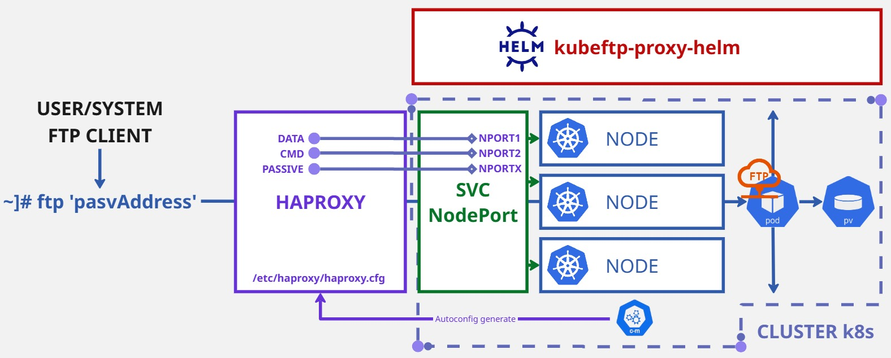

# kubeftp-proxy-helm


This Helm chart provides a plug-and-play deployment of vsftpd for exposing FTP in Kubernetes. 

A HAProxy configuration is automatically generated based on [official Passive FTP best practices](https://www.haproxy.com/documentation/haproxy-configuration-tutorials/protocol-support/passive-ftp/), ensuring full compatibility with Passive FTP and FTPS protocols, even across multi-node Kubernetes clusters.

Control, data, and a customizable range of Passive Ports are exposed via stable NodePorts, guaranteeing predictable and seamless FTP access.

Designed to maintain FTP connectivity even when pods move across nodes.



Docker source image  : fauria/docker-vsftpd

## Main Features
- Deploys a vsftpd server inside Kubernetes.
- Exposes the service via NodePort.
- Order-preserving NodePort allocation :
  - Each FTP Passive Port is mapped to a corresponding NodePort in ascending order
  - Ensures predictable, logical port forwarding
  -	Simplifies HAProxy frontend/backend configuration
- Automatically generates a dedicated HAProxy configuration :
  - Control connection management (port 21),
  - Data connection management (port 20),
  - Passive ports range configuration,
  - Dynamic creation of a Kubernetes ConfigMap containing the haproxy.cfg file.
- Pod mobility and resilience :
  - All backend nodes are included in HAProxy backends for every port.
  - Guarantees seamless FTP service availability even if the pod moves across nodes.
- Persistent storage available for user data (/home/vsftpd) and logs (/var/log/vsftpd).

## Prerequisites

Before deploying kubeftp-proxy-helm, make sure you have :
- A running Kubernetes cluster (v1.20+ recommended)
- Helm 3.x installed 
- Access to a HAProxy machine (v2.4+ recommended)
  - HAProxy Connectivity Requirements
    - The HAProxy machine must be able to reach the Kubernetes cluster nodes directly on the NodePort range (or the LoadBalancer IP if used).
    - It is highly recommended that HAProxy is connected to two networks :
      - A frontend network used by FTP clients, corresponding to the pasvAddress
      - A workload/internal network with direct access to the Kubernetes node IPs
    - Firewalls and security groups must allow TCP traffic between HAProxy and Kubernetes nodes on : FTP control port (21), FTP data port (20), full passive port range (21100-21110).
- A Kubernetes namespace available
- Persistent Volumes configured for enable FTP home and logs

## Installation

1. Clone the repository

```bash
git clone https://github.com/adrghph/kubeftp-proxy-helm.git
cd kubeftp-proxy-helm
```

2. Configure your values.yaml (see below Configuration)

3. Create and install into a dedicated namespace (recommended)

```bash
helm install vsftpd ./kubeftp-proxy-helm --namespace <namespace> --create-namespace
```

## Configuration

| Parameter                | Description                                                               | Default Value           |
|---------------------------|---------------------------------------------------------------------------|--------------------------|
| `username`                | FTP username                                                              | `user`                   |
| `password`                | FTP password (stored in a Kubernetes Secret)                              | `pass`                   |
| `pasvAddress`             | Passive IP address (set to your external HAProxy IP)             | `""`                     |
| `controlPort`             | FTP control port                                                          | `21`                     |
| `dataPort`                | FTP data port                                                             | `20`                     |
| `pasvMinPort`             | Minimum passive port                                                      | `21100`                  |
| `pasvMaxPort`             | Maximum passive port                                                      | `21110`                  |
| `service.type`            | Kubernetes Service type (NodePort or LoadBalancer)                        | `NodePort`               |
| `service.nodePortCommand` | NodePort for control connection (port 21)                                 | `30021`                  |
| `service.nodePortData`    | NodePort for data connection (port 20)                                    | `30020`                  |
| `service.nodePortPassiveMin` | First NodePort for passive data connections                             | `32100`                  |
| `image.repository`        | FTP server image repository                                               | `fauria/vsftpd`           |
| `image.tag`               | Image tag                                                                 | `latest`                 |
| `image.pullPolicy`        | Image pull policy                                                         | `IfNotPresent`           |
| `persistence.home.enabled`| Enable persistent volume for FTP home directory (/home/vsftpd)             | `true`                   |
| `persistence.home.size`   | Size of the persistent volume for home                                     | `1Gi`                    |
| `persistence.home.storageClassName` | StorageClass to use for home (empty for default)                   | `""`                     |
| `persistence.logs.enabled`| Enable persistent volume for logs (/var/log/vsftpd)                        | `true`                   |
| `persistence.logs.size`   | Size of the persistent volume for logs                                     | `100Mi`                  |
| `persistence.logs.storageClassName` | StorageClass to use for logs (empty for default)                   | `""`                     |
| `haproxy.timeout`         | Timeout for both client and server inactivity                             | `10m`                    |
| `haproxy.nodesIPs`        | List of worker node IP addresses                                           | `10.0.0.1, 10.0.0.2, 10.0.0.3` |

## Retrieving the HAProxy Configuration

After deployment, the FTP-ready HAProxy configuration is stored inside a Kubernetes ConfigMap.

To retrieve it in YAML format :
```bash
kubectl get configmap my-ftp-haproxy-config -n <namespace> -o yaml
```
To extract the configuration directly into a file :
```bash
kubectl get configmap my-ftp-haproxy-config -n <namespace> -o jsonpath='{.data.haproxy\.cfg}' > haproxy.cfg
```
## Apply conf HAproxy 

Once you've retrieved the generated configuration (haproxy.cfg), simply copy and paste it into your HAProxy server and restart service : 

```bash
systemctl restart haproxy
```
## Access to ftp server as client 

Once deployed and HAProxy is configured correctly, you can connect to the FTP service using any standard FTP client.
```bash
ftp <pasvAddress>
```

## Important Notes
•	Designed for use with a standalone HAProxy capable of TCP traffic forwarding to Kubernetes NodePorts.
•	The generated haproxy.cfg should be deployed on the HAProxy machine to enable proper FTP Passive mode functionality.
•	In environments where LoadBalancer services allow full control over port mappings (such as custom MetalLB deployments or cloud LBs with port-range support), kubeftp-proxy-helm can work without an additional HAProxy server and can work with service in LoadBalancer mode. 

## Why this project
Kubernetes is not natively designed for FTP services, especially for Passive Mode, which requires fine-grained control over open ports and connections.
This project was born out of the need to work around this limitation in a real-world infrastructure, by leveraging HAProxy and stable NodePorts in a predictable and resilient way.
kubeftp-proxy-helm offers a simple, reliable, and maintainable solution to integrate a fully functional FTP server into a multi-node Kubernetes cluster without sacrificing compatibility with standard FTP clients.
The idea emerged while facing challenges with a HAProxy supervised by a Tanzu Supervisor Cluster, where direct configuration changes were restricted.
This Helm chart was designed to provide flexibility and control at the Kubernetes layer, while enabling seamless integration with external load balancers under constrained environments.
Link incoming  
